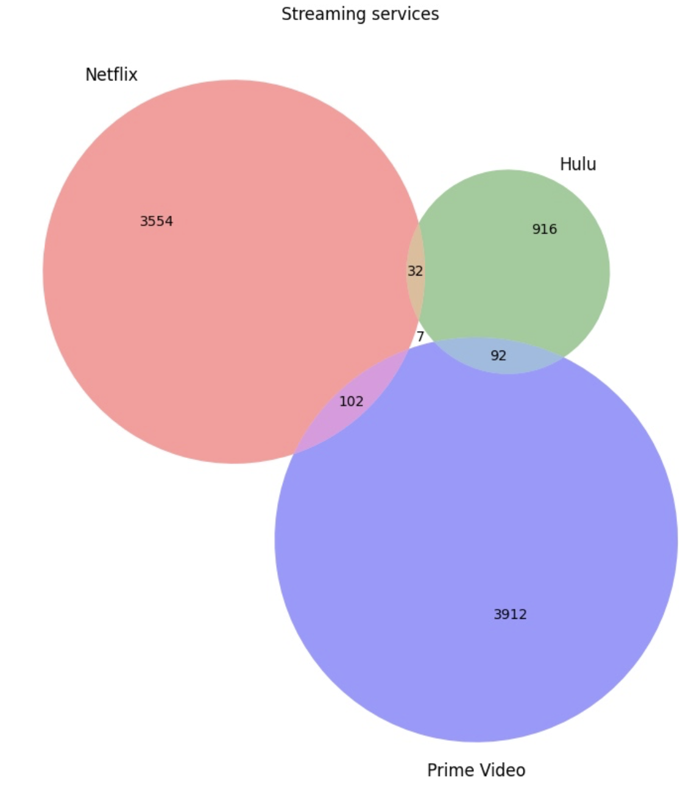
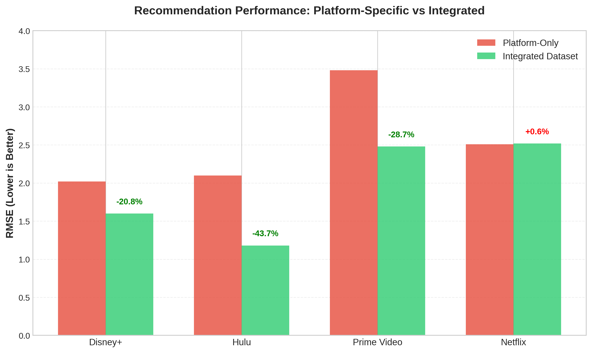
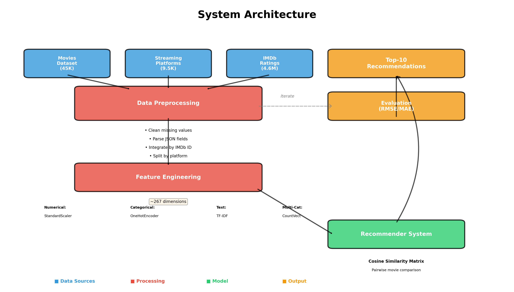
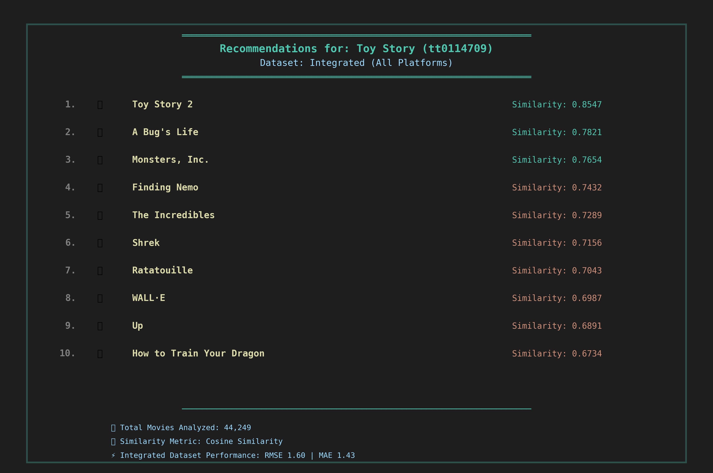

# 🎬 Cross-Platform Movie Recommendation System

[](https://www.python.org/downloads/)
[](https://opensource.org/licenses/MIT)

A unified movie recommendation system that integrates data from **Netflix**, **Hulu**, **Prime Video**, and **Disney+** to overcome limitations of platform-segregated recommendations.

---

## 📋 Table of Contents
- [Problem Statement](#-problem-statement)
- [Solution Overview](#-solution-overview)
- [Key Results](#-key-results)
- [System Architecture](#️-system-architecture)
- [Technical Implementation](#-technical-implementation)
- [Installation](#-installation)
- [Usage](#-usage)
- [Project Structure](#-project-structure)
- [Performance Evaluation](#-performance-evaluation)

---

## 🎯 Problem Statement

Streaming platforms operate isolated recommendation systems based only on their available content. This **segregation limits recommendation quality** since user preferences often span across multiple platforms.

### Platform Content Segregation



*Figure: Minimal content overlap between major streaming services. Movies are primarily exclusive to each platform, limiting single-platform recommendation systems.*

**Key Issues:**
- Limited content pool per platform
- No cross-platform preference learning
- Suboptimal recommendations due to data silos
- Users must manually search across platforms

---

## 💡 Solution Overview

Built a **content-based recommender** using **cosine similarity** across integrated datasets from four major streaming services. The system analyzes comprehensive movie metadata to find similar movies **regardless of platform availability**.

### What Makes This Different?
✅ **Unified Data Integration** - Combined 45,466 movies from 4 platforms  
✅ **Rich Feature Engineering** - Multi-modal features (text, categorical, numerical)  
✅ **Quantitative Validation** - Evaluated using 4.6M user ratings from IMDb  
✅ **Production-Ready Code** - Modular architecture with clean separation of concerns  

---

## 📊 Key Results

Integration of streaming platform data **significantly improved recommendation quality** across all metrics:



| Platform | Platform-Only RMSE | Integrated RMSE | Improvement |
|----------|-------------------|-----------------|-------------|
| **Disney+** | 2.02 | **1.60** | 🔥 **20.8%** |
| **Hulu** | 2.10 | **1.18** | 🔥 **43.7%** |
| **Prime Video** | 3.48 | **2.48** | 🔥 **28.7%** |
| **Netflix** | 2.51 | **2.52** | ✓ Comparable |

> **Key Finding:** Data integration improves recommendation quality by 20-44% for platforms with limited content diversity. Netflix shows strong baseline performance due to its extensive catalog.

---

## 🏗️ System Architecture



### Pipeline Components

1. **Data Preprocessing**
   - Load and clean 3 datasets (TMD, SPD, IMDb Ratings)
   - Handle missing values and JSON fields
   - Integrate using IMDb ID as key
   - Split by streaming platform

2. **Feature Engineering**
   - **Numerical Pipeline**: StandardScaler for release_date, runtime
   - **Single-Categorical**: OneHotEncoder for language, collections (min_frequency=0.01)
   - **Multi-Categorical**: CountVectorizer for genres, companies, languages
   - **Text Pipeline**: TF-IDF for overview and title (max_df=0.8, min_df=0.025)

3. **Recommender System**
   - Pairwise cosine similarity matrix
   - Top-10 recommendations per query
   - Batch prediction support

4. **Evaluation**
   - RMSE & MAE metrics
   - User-based validation
   - Platform comparison analysis

---

## 🛠 Technical Implementation

### Tech Stack

```
Data Processing:    pandas, numpy
Feature Engineering: scikit-learn (TF-IDF, StandardScaler, OneHotEncoder)
Similarity Metric:   Cosine Similarity
Evaluation:         RMSE, MAE
Environment:        Python 3.8+, Jupyter
```

### Key Features

- **Custom Tokenizer** - Handles unconventional movie title punctuation
- **Dimensionality Reduction** - Frequency-based feature filtering
- **Modular Design** - Separate modules for preprocessing, features, model, evaluation
- **Batch Processing** - Efficient recommendation generation
- **Comprehensive Logging** - Detailed evaluation reports

---

## 📦 Installation

### Prerequisites
- Python 3.8 or higher
- pip package manager

### Setup

```bash
# Clone the repository
git clone https://github.com/yourusername/movie-recommender.git
cd movie-recommender

# Install dependencies
pip install -r requirements.txt

# Run demo notebook
jupyter notebook demo.ipynb
```

---

## 🚀 Usage

### Quick Start

```python
from src import load_and_integrate_data, prepare_features, build_recommender

# 1. Load and preprocess data
datasets = load_and_integrate_data('data/movies.csv', 'data/streaming.csv')

# 2. Engineer features
features, pipeline, ids = prepare_features(datasets['all'])

# 3. Build recommender
recommender = build_recommender(features, num_recommendations=10)

# 4. Get recommendations
recommendations = recommender.predict('tt0114709')  # Toy Story
for movie_id, score in recommendations:
    print(f"{movie_id}: {score:.4f}")
```

### Example Output



```
Recommendations for: Toy Story (tt0114709)
================================================================

 1. Toy Story 2                                     (Similarity: 0.8547)
 2. A Bug's Life                                    (Similarity: 0.7821)
 3. Monsters, Inc.                                  (Similarity: 0.7654)
 4. Finding Nemo                                    (Similarity: 0.7432)
 5. The Incredibles                                 (Similarity: 0.7289)
 6. Shrek                                           (Similarity: 0.7156)
 7. Ratatouille                                     (Similarity: 0.7043)
 8. WALL·E                                          (Similarity: 0.6987)
 9. Up                                              (Similarity: 0.6891)
10. How to Train Your Dragon                        (Similarity: 0.6734)
```

---

## 📁 Project Structure

```
movie-recommender/
├── src/
│   ├── __init__.py                 # Package initialization
│   ├── data_preprocessing.py       # Data loading, cleaning, integration
│   ├── feature_engineering.py      # Vectorization pipelines
│   ├── recommender.py              # Recommender class
│   └── evaluation.py               # Performance metrics
│
├── images/
│   ├── platform_overlap.png        # Venn diagram
│   ├── performance_comparison.png  # Results bar chart
│   ├── architecture.png            # System flowchart
│   └── demo_output.png             # Sample recommendations
│
├── demo.ipynb                      # Interactive demonstration
├── requirements.txt                # Python dependencies
└── README.md                       # This file
```

---

## 📈 Performance Evaluation

### Methodology

1. **User-Based Validation**
   - Found users who rated both target and all recommended movies
   - Compared target movie rating to recommended movie ratings
   - Calculated RMSE/MAE across all comparisons

2. **Metrics Used**
   - **RMSE (Root Mean Square Error)**: Penalizes larger errors more heavily
   - **MAE (Mean Absolute Error)**: Equal weight to all errors

3. **Evaluation Dataset**
   - 4,669,820 ratings from 1,499,238 users
   - 351,109 movies rated
   - IMDb ratings scale: 1-10

### Detailed Results

#### Disney+ Platform

```
Platform-Specific Dataset:
  RMSE: 2.0248
  MAE:  1.5000

Fully Integrated Dataset:
  RMSE: 1.6036  (-20.8% ✓)
  MAE:  1.4286  (-4.8%  ✓)
```

#### Hulu Platform

```
Platform-Specific Dataset:
  RMSE: 2.0976
  MAE:  1.6000

Fully Integrated Dataset:
  RMSE: 1.1832  (-43.7% ✓✓)
  MAE:  1.0000  (-37.5% ✓✓)
```

#### Prime Video Platform

```
Platform-Specific Dataset:
  RMSE: 3.4785
  MAE:  3.3000

Fully Integrated Dataset:
  RMSE: 2.4785  (-28.7% ✓)
  MAE:  2.1429  (-35.1% ✓)
```

#### Netflix Platform

```
Platform-Specific Dataset:
  RMSE: 2.5100
  MAE:  2.3000

Fully Integrated Dataset:
  RMSE: 2.5249  (+0.6%)
  MAE:  2.3750  (+3.3%)
```

### Analysis

**Why Integration Works:**
- Platforms with smaller catalogs (Disney+, Hulu) benefit most from additional data
- More diverse training data improves feature learning
- Cross-platform patterns reveal universal movie similarities
- Netflix's extensive catalog already provides strong baseline performance

---

## 🔍 Dataset Information

### Sources

1. **The Movies Dataset (TMD)**
   - 45,466 movies with 23 attributes
   - Metadata: genres, runtime, production details, descriptions
   - [Kaggle Link](https://www.kaggle.com/datasets/rounakbanik/the-movies-dataset)

2. **Streaming Platforms Dataset (SPD)**
   - 9,515 entries across 4 platforms
   - Platform availability: Netflix, Hulu, Prime Video, Disney+
   - [Kaggle Link](https://www.kaggle.com/datasets/ruchi798/movies-on-netflix-prime-video-hulu-and-disney)

3. **IMDb Users' Ratings Dataset**
   - 4.6M ratings from 1.5M users
   - Used for quantitative evaluation
   - [IEEE DataPort](https://dx.doi.org/10.21227/br41-bd49)

### Data Processing Stats

| Stage | Input | Output | Reduction |
|-------|-------|--------|-----------|
| Raw Data | 45,466 movies | - | - |
| After Cleaning | - | 44,249 movies | -2.7% |
| After Integration | - | 9,515 movies | Filtered to streaming |
| Feature Dimensions | 10 raw features | ~267 dimensions | 26.7x expansion |

---

## 🎓 Background

This project was developed as part of **HKUST MSBD 5001 - Foundations of Data Analytics** course to demonstrate:
- Large-scale data integration and preprocessing
- Advanced feature engineering techniques
- Content-based recommendation systems
- Quantitative model evaluation

### Learning Outcomes

✓ Data cleaning and integration across heterogeneous sources  
✓ Feature engineering for high-dimensional text and categorical data  
✓ Implementing similarity-based recommendation algorithms  
✓ Statistical evaluation using real-world user behavior data  
✓ Production-quality code organization and documentation  

---

## 🚀 Future Enhancements

- [ ] **Collaborative Filtering** - Incorporate user-user and item-item patterns
- [ ] **Deep Learning Embeddings** - Use neural networks for feature learning
- [ ] **Hybrid Approach** - Combine content-based and collaborative methods
- [ ] **Real-time Updates** - Stream new movie releases and ratings
- [ ] **Web API** - Deploy as RESTful service
- [ ] **A/B Testing Framework** - Compare recommendation strategies
- [ ] **Multi-language Support** - Expand beyond English content

---

## 📝 Citation

If you use this code or methodology in your research, please cite:

```bibtex
@misc{lee2024crossplatform,
  title={Cross-Platform Movie Recommendation System},
  author={Lee, Jun Hyuk},
  year={2024},
  institution={Hong Kong University of Science and Technology},
  course={MSBD 5001 - Foundations of Data Analytics}
}
```

---

## 📄 License

This project is licensed under the MIT License - see the [LICENSE](LICENSE) file for details.

---

## 🙏 Acknowledgments

- **Datasets**: Kaggle community and IEEE DataPort
- **Course**: HKUST MSBD 5001 instructors and TAs
- **Inspiration**: Real-world streaming platform fragmentation problem

---

## 📧 Contact

**Jun Hyuk Lee**  
MSc in Big Data Technology, HKUST  
📧 jhleeak@connect.ust.hk  
🔗 [LinkedIn](#) | [GitHub](#)

---

<div align="center">

**⭐ Star this repo if you find it helpful!**

[Report Bug](https://github.com/yourusername/movie-recommender/issues) · [Request Feature](https://github.com/yourusername/movie-recommender/issues)

</div>
